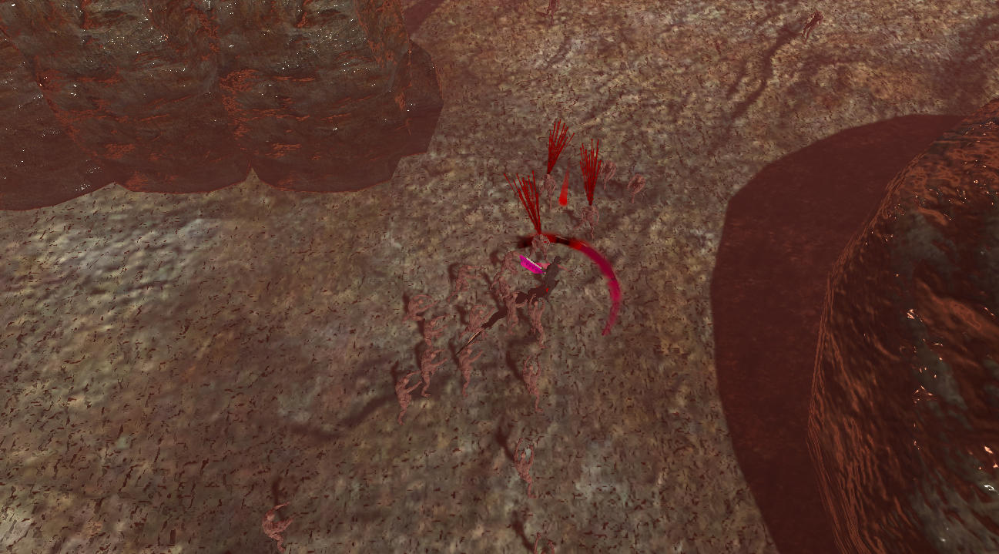

# Aftermath
 A 3D top-down, hack-and-slash game (made using unity). This game places the player in a post-apocalyptic Earth to fend for their life as an endless horde of enemies attacks them.

Created through the collaborative effort of: 

	Reymond Pamelar

	Tyler Nguyen

	Sam Hsu

	Reian Festejo

# Game Design Document
Further explanation (through a Game Design Document) of the game can be found under: Assets/Documentation/CS 583_ 3D Game GDD (1).docx

# Executable
An executable of the game can be found under: Releases/JS1.0/Team_OnlyChamps_Project_3B.exe

# Screenshots

